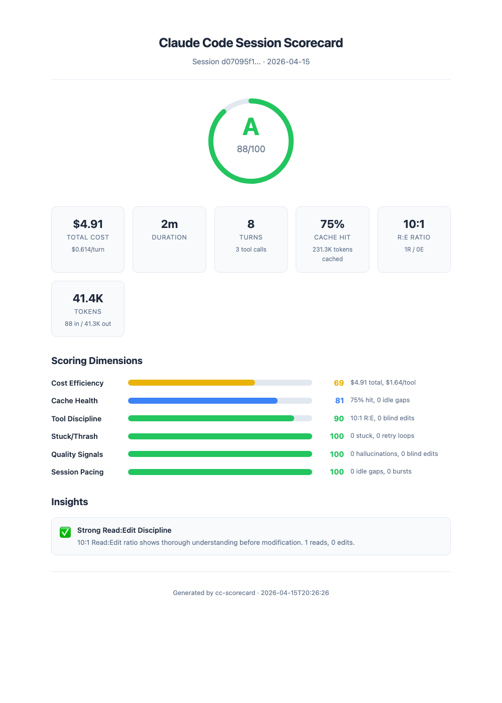

<p align="center">
  <h1 align="center">cc-scorecard</h1>
  <p align="center"><strong>Grade your Claude Code sessions.</strong></p>
  <p align="center">
    6-dimension quality analysis &bull; Self-contained HTML report &bull; Zero dependencies
  </p>
</p>

---

Every Claude Code session writes a JSONL transcript to `~/.claude/projects/`. Nobody reads them. **cc-scorecard** does — it parses your transcripts, computes a letter grade across 6 quality dimensions, and generates a visual HTML report you can share.

## Example Report

<p align="center">
  
</p>

The HTML report includes an overall grade circle, 6 dimension score bars, key session metrics, and actionable insights — all in a self-contained file with no external dependencies.

### Terminal Output

```
━━━━━━━━━━━━━━━━━━━━━━━━━━━━━━━━━━━━━━━━━━━━━━━━━━━━━━━━━━━━
  SESSION SCORECARD — Grade: A (88/100)
━━━━━━━━━━━━━━━━━━━━━━━━━━━━━━━━━━━━━━━━━━━━━━━━━━━━━━━━━━━━
  Session:  d07095f1...
  Duration: 1h 12m
  Cost:     $8.43
  Turns:    28
  Tools:    35
━━━━━━━━━━━━━━━━━━━━━━━━━━━━━━━━━━━━━━━━━━━━━━━━━━━━━━━━━━━━

  Cost Efficiency    █████████████░░░░░░░  69/100  $8.43 total
  Cache Health       ████████████████░░░░  81/100  88% hit ratio
  Tool Discipline    ██████████████████░░  90/100  4.2:1 R:E ratio
  Stuck/Thrash       ████████████████████ 100/100  0 stuck periods
  Quality Signals    ████████████████████ 100/100  0 hallucinations
  Session Pacing     ████████████████████ 100/100  0 idle gaps
━━━━━━━━━━━━━━━━━━━━━━━━━━━━━━━━━━━━━━━━━━━━━━━━━━━━━━━━━━━━
```

## Quick Start

```bash
# Analyze your current project's latest session
npx cc-scorecard

# Analyze a specific transcript file
npx cc-scorecard --file ~/.claude/projects/-Users-you-myproject/session-id.jsonl

# JSON output for scripting
npx cc-scorecard --json
```

No config. No API keys. No setup.

## The 6 Dimensions

| Dimension | Weight | What It Measures | Why It Matters |
|-----------|--------|------------------|----------------|
| **Cost Efficiency** | 20% | $/turn normalized for model pricing | Catches runaway sessions before they drain quota |
| **Cache Health** | 20% | Cache hit ratio + idle gap detection | Every 5-min pause resets the cache — you pay for full context re-send |
| **Tool Discipline** | 20% | Read:Edit ratio, blind edit detection | The #1 predictor of session quality (see below) |
| **Stuck/Thrash** | 15% | Consecutive failures, retry loops | Stuck loops waste 15-20% of typical session tokens |
| **Quality Signals** | 15% | Hallucination pattern detection | Catches the "failed Read → Edit same path" pattern |
| **Session Pacing** | 10% | Idle gaps and burst analysis | Uneven pacing kills cache efficiency |

### The Key Insight: Read:Edit Ratio

The single most predictive signal for session quality:

| R:E Ratio | Meaning | Quality Impact |
|-----------|---------|----------------|
| **> 3:1** | Agent reads extensively before editing | Significantly fewer hallucinations |
| 2:1 – 3:1 | Reasonable discipline | Some blind spots |
| 1:1 – 2:1 | Editing as much as reading | Elevated risk |
| **< 1:1** | Editing more than reading | Agent is guessing |

This metric emerged from analyzing the Opus 4.6 reasoning regression, where degraded sessions showed a characteristic R:E ratio collapse before quality visibly dropped.

### Grading Scale

| Grade | Score | Meaning |
|-------|-------|---------|
| **A** | ≥ 85 | Excellent — efficient, disciplined, clean |
| **B** | ≥ 70 | Good — minor inefficiencies |
| **C** | ≥ 55 | Fair — notable waste or quality issues |
| **D** | ≥ 40 | Poor — significant problems |
| **F** | < 40 | Failing — major issues across dimensions |

## How It Works

```
~/.claude/projects/<hash>/<session>.jsonl    ← Already exists on your machine
         │
         ▼
   cc-scorecard                              ← Reads token usage, tool calls, timing
         │
         ├── Cost: token counts × model pricing
         ├── Cache: cache_read / (cache_read + cache_creation)
         ├── Tools: Read:Edit ratio, blind edit detection
         ├── Stuck: consecutive failure runs, retry fingerprints
         ├── Quality: failed-lookup → write correlation
         └── Pacing: idle gap detection, burst analysis
         │
         ▼
   HTML Report + Terminal Summary + JSON
```

**Zero dependencies.** Pure Node.js built-ins. No databases, no API calls, no external services.

## CLI Reference

| Flag | Description |
|------|-------------|
| `--file <path>` | Analyze a specific JSONL transcript |
| `--session <id>` | Find transcript by session ID (prefix match) |
| `--project <dir>` | Override project directory |
| `--json` | JSON output to stdout |
| `--html` | Generate HTML report (default) |

### JSON Output

```bash
npx cc-scorecard --json | jq '.overall'
# { "score": 88, "grade": "A" }

npx cc-scorecard --json | jq '.cacheHealth.details'
# { "hitRatio": 0.88, "cacheRead": 45000, "idleGaps": 0, ... }
```

## Requirements

- Node.js ≥ 18
- Claude Code sessions (transcripts are created automatically)

## Background

Built from production experience running multi-agent Claude Code sessions (4 agents, 8+ hour sessions, 500+ PRs). The scoring dimensions reflect real patterns that correlate with fewer bugs, less rework, and lower cost.

## License

MIT — [Dan Arouag](https://github.com/daroroug)
